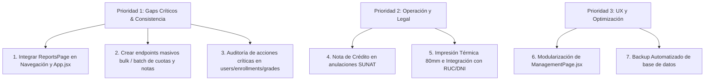

# Análisis de Puntos de Mejora y Áreas por Desarrollar - Instituto Computron

Este análisis evalúa el estado actual del **Sistema de Gestión de Alumnos del Instituto Computron** y detalla los puntos de mejora crítica, vulnerabilidades de diseño y módulos pendientes de desarrollo. El objetivo es consolidar y robustecer la plataforma tanto a nivel técnico (backend, seguridad, base de datos) como de interfaz de usuario.

---

## 1. Diagnóstico General y Gaps Críticos

El sistema cuenta con una base sólida: base de datos en 3FN con claves foráneas, enrutador modular, hashing de contraseñas robusto, control de sesiones seguro (JWT + HttpOnly refresh token) y suites de pruebas automatizadas funcionales. Sin embargo, se ha identificado un **gap de integración crítico** en el frontend:

### 🔍 El Caso del Módulo de Reportes Huérfano
*   **Problema:** El componente [ReportsPage.jsx](file:///Users/mark/Desktop/SISTEMCOMPUTRON/frontend/src/pages/ReportsPage.jsx) está implementado con filtros avanzados y exportación CSV de saldos, morosidad y pagos por sede. Además, los endpoints de backend en [reports.routes.js](file:///Users/mark/Desktop/SISTEMCOMPUTRON/backend/src/routes/reports.routes.js) están operativos.
*   **Defecto:** Este módulo **no está enrutado** en la aplicación. La ruta `/reports` en [App.jsx](file:///Users/mark/Desktop/SISTEMCOMPUTRON/frontend/src/App.jsx#L177) redirige forzosamente a `/management` y el menú de navegación en [AppShell.jsx](file:///Users/mark/Desktop/SISTEMCOMPUTRON/frontend/src/components/AppShell.jsx) no contiene el acceso para reportes, haciendo imposible que el personal administrativo acceda a las exportaciones financieras.
*   **Acción recomendada:** Agregar la pestaña "Reportes" en los grupos del menú y configurar su ruta en React Router para recuperar la funcionalidad.

---

## 2. Defectos de Arquitectura en la API y Frontend

Se detectaron patrones de diseño ineficientes (anti-patrones) que afectan el rendimiento y la consistencia de los datos en entornos reales:

### ⚠️ Ciclos de Peticiones en Frontend (Falta de Endpoints Bulk)
*   **Problema en Cuotas:** Al matricular a un estudiante en [ManagementPage.jsx](file:///Users/mark/Desktop/SISTEMCOMPUTRON/frontend/src/pages/ManagementPage.jsx#L1895-L1926), si tiene una cuota de matrícula más 12 mensualidades, el frontend ejecuta **13 peticiones HTTP POST individuales en un ciclo `for`** hacia `/api/enrollments/:id/installments`.
*   **Problema en Calificaciones y Asistencias:** Un docente al calificar una evaluación o registrar la asistencia de una sección (ej. 30 alumnos) tiene que enviar peticiones HTTP individuales por cada registro.
*   **Consecuencias:**
    1.  **Inconsistencia:** Si la petición número 5 falla (por corte de red o timeout), la matrícula queda incompleta en base de datos (con menos cuotas de las debidas) y obliga a correcciones manuales.
    2.  **Rendimiento:** Sobrecarga innecesaria en la red y base de datos (múltiples transacciones de inserción cortas en lugar de una masiva).
    3.  **Límite de Peticiones:** Puede disparar involuntariamente los umbrales de rate limit en producción.
*   **Propuesta:** Implementar endpoints por lote (bulk) como `/api/enrollments/:id/installments/bulk` y `/api/academic/grades/batch` que reciban arrays de datos y ejecuten las inserciones dentro de una sola transacción SQL protegida (`withTransaction`).

### 📐 Tamaño Desmesurado de Componentes Frontend
*   **Defecto:** El archivo [ManagementPage.jsx](file:///Users/mark/Desktop/SISTEMCOMPUTRON/frontend/src/pages/ManagementPage.jsx) contiene más de **4,800 líneas de código**. Gestiona de forma síncrona alumnos, profesores, cursos, matrículas, sedes, periodos y certificados en un solo componente React.
*   **Consecuencia:** Incrementa drásticamente el tiempo de compilación y recarga en desarrollo (Vite HMR), degrada la legibilidad y eleva la probabilidad de provocar regresiones.
*   **Propuesta:** Refactorizar y modularizar las vistas convirtiendo cada pestaña en un subcomponente independiente (ej. `StudentsTab.jsx`, `TeachersTab.jsx`, `CampusesTab.jsx`, `PeriodsTab.jsx`).

---

## 3. Integración SUNAT (Facturación Electrónica)

Aunque la API de backend está preparada para interactuar con la API de facturación Laravel, la integración legal y técnica requiere los siguientes desarrollos adicionales:

| Punto de Mejora | Impacto / Riesgo | Descripción / Propuesta |
| :--- | :--- | :--- |
| **Notas de Crédito y Débito** | 🔴 Alto (Legal) | Actualmente, cuando una transacción se anula (`VOIDED`), el sistema cambia su estado pero no genera el documento de Nota de Crédito. Ante SUNAT, toda boleta/factura emitida y luego anulada requiere una Nota de Crédito electrónica de sustento. |
| **Validación de Identidad** | 🟡 Medio | Se requiere un endpoint/servicio de consulta de DNI (RENIEC) y RUC (SUNAT) en el flujo de caja. Si el usuario ingresa un RUC inválido para una factura, el envío fallará en la API SUNAT. |
| **Envíos en Segundo Plano (Queue)** | 🟡 Medio | Las solicitudes de envío a la API SUNAT ocurren síncronamente al procesar el pago. Si el servicio de facturación está fuera de línea o tarda en responder, retrasará la interfaz del cajero. Se sugiere encolar las boletas en una cola de base de datos. |
| **Manejo de Errores de Validación** | 🟢 Bajo | Mejorar el mapeo de errores de SUNAT (`eds.sunat_error_code`) para mostrar mensajes amigables al cajero (ej. "RUC inactivo", "Monto supera límite para boletas sin DNI"). |

---

## 4. Módulo de Caja Administrativa y Pagos

La operativa diaria de caja presenta áreas de optimización para facilitar la labor de secretariado y dirección:

*   **Conciliación y Aprobación de Diferencias:** El cierre de caja calcula y registra el `difference_amount` (sobrantes/faltantes). Sin embargo, no existe un flujo de aprobación en la UI donde el Administrador o Director valide el motivo de la diferencia mediante comentarios bloqueados y firma digital de auditoría.
*   **Impresión de Tickets Térmicos (Ticketeras POS):** El formato actual está diseñado para hojas A4 o A5 dobles. Las cajas administrativas operan de forma más ágil con ticketeras térmicas estándar (58mm o 80mm). Se debe desarrollar una plantilla CSS adaptada a la impresión directa por POS.
*   **Conciliación Bancaria Automática:** Para pagos digitales y transferencias, los administradores digitan manualmente el código de referencia. Se sugiere crear una funcionalidad que permita importar el extracto bancario (CSV) de cuentas corrientes para conciliar automáticamente depósitos e identificar morosos.

---

## 5. Gestión Académica e Historial del Alumno

*   **Consistencia de Pesos en Evaluaciones:** En [academic.routes.js](file:///Users/mark/Desktop/SISTEMCOMPUTRON/backend/src/routes/academic.routes.js), un docente puede registrar evaluaciones con cualquier peso (1-100%). No existe una validación en backend que asegure que la suma de pesos de las evaluaciones programadas para una sección sea exactamente el 100% de la nota final, lo cual puede distorsionar los promedios ponderados.
*   **Migración de Notas y Asistencia en Traslados:** El flujo de traslados a nivel de matrícula está contemplado en `student_transfer_requests`. Sin embargo, al completar el traslado del alumno a una nueva sede/salón, el sistema debe transferir automáticamente su récord acumulado de asistencias y calificaciones para evitar pérdidas de información.
*   **Kárdex / Historial Académico Consolidado:** Falta un módulo de consulta rápida donde un docente o administrador pueda visualizar la trayectoria completa del alumno (todos sus cursos aprobados, desaprobados, promedio ponderado e historial de matrículas) en una sola vista exportable a PDF.
*   **Almacenamiento Cloud para Recursos Virtuales:** Los recursos de la biblioteca y prácticas de exámenes guardan archivos en el directorio local `/uploads` del servidor Express. Esto saturará rápidamente el disco en producción y dificulta la alta disponibilidad. Se recomienda migrar a un almacenamiento en la nube (ej. AWS S3 o Cloudinary) controlado por firmas temporales desde el backend.

---

## 6. DevOps, Seguridad e Infraestructura

*   **Brecha de Auditoría (Audit Logs Vacíos):** Aunque la tabla `audit_logs` está diseñada para registrar acciones críticas, **casi ninguna acción administrativa la escribe**. Operaciones de gran riesgo como desactivar usuarios, cambiar permisos de roles en [users.routes.js](file:///Users/mark/Desktop/SISTEMCOMPUTRON/backend/src/routes/users.routes.js), cambiar notas de alumnos o anular matrículas ocurren sin dejar rastro de auditoría. Es prioritario integrar el registro automático de logs para toda mutación (POST/PUT/DELETE).
*   **Respaldos Automatizados (Backup Plan):** La base de datos es el núcleo crítico de la institución. Es prioritario implementar un script cron que realice un volcado de base de datos (`pg_dump`) diariamente en la madrugada y lo envíe cifrado a un bucket externo de almacenamiento en frío.
*   **Auditoría de Acciones en la Interfaz (UI):** No hay pantallas en la interfaz del Administrador para consultar los logs de auditoría visualmente, requiriendo consultas directas a la base de datos SQL en casos de incidente.
*   **Gestión y Revocación de Sesiones Activas:** El backend emite JWT y tokens de refresco, pero no provee un mecanismo para invalidar todas las sesiones de un usuario de forma remota en caso de robo de credenciales o despido del empleado.
*   **Resiliencia del Envío de Correos (SMTP):** El envío del código de activación durante el registro ocurre síncronamente dentro de la llamada de la API. Si el servidor SMTP externo sufre microcortes o demoras, la creación de usuarios administrativos fallará temporalmente. Se recomienda una cola en segundo plano para procesar notificaciones.

---

## Plan de Acción Recomendado (Por Prioridades)

Para optimizar el desarrollo, se propone abordar las mejoras bajo la siguiente jerarquía de urgencia:

